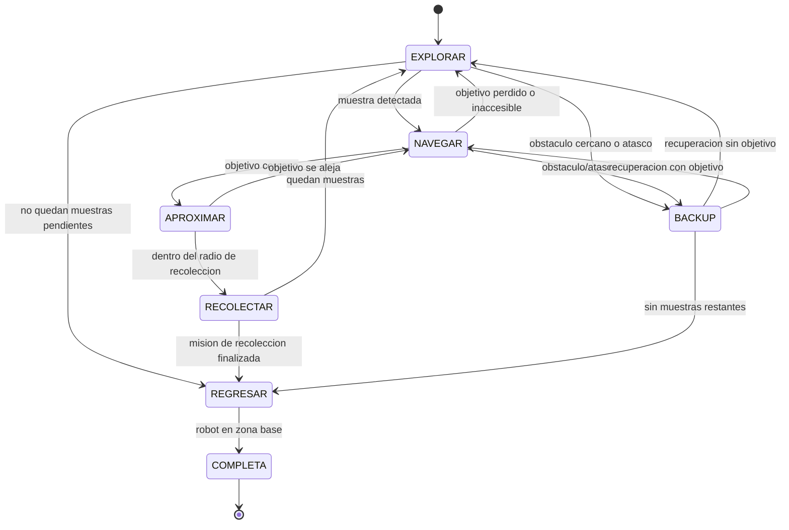

# ExploRover - Challenge 2 Robot Explorador (Webots)

Este repositorio implementa un rover autonomo para exploracion y recoleccion de muestras en un entorno desconocido de Webots, alineado al track de robotica del hackathon.

Objetivo del sistema:

- Explorar sin colisionar con obstaculos.
- Detectar puntos de interes (muestras).
- Navegar hacia las muestras y recolectar al menos una.
- Bonus: recolectar multiples muestras y regresar autonomamente a base.

## 1. Resumen rapido de lo que ya hace

- Navegacion autonoma con locomocion diferencial.
- Evasion de obstaculos en tiempo real.
- Deteccion de muestras por vision (recognition).
- Planificacion de ruta con A* sobre occupancy grid.
- Modo de recuperacion por atasco o bloqueo (BACKUP).
- Recoleccion fisica con pala frontal.
- Retorno a base al terminar la mision.
- Interfaz grafica para configurar obstaculos y muestras sin tocar el codigo del controlador.

## 2. Sensores y actuadores usados

### Sensores

| Componente | Tipo | Uso principal |
|---|---|---|
| lidar | Sensor de distancia 360 | Detectar obstaculos, actualizar mapa de ocupacion y medir riesgo frontal |
| camera + recognition | Sensor visual | Detectar e identificar muestras en el entorno |
| gps | Sensor de posicion | Obtener coordenadas globales x, y |
| compass | Sensor de orientacion | Estimar heading theta para control y navegacion |

Nota: map_display se usa para visualizacion/diagnostico (HUD y mapa), no como sensor de entrada para la logica.

### Actuadores

| Componente | Tipo | Uso principal |
|---|---|---|
| left_motor | Actuador de traccion | Velocidad rueda izquierda |
| right_motor | Actuador de traccion | Velocidad rueda derecha |
| shovel_motor | Actuador mecanico | Bajar/subir pala para recolectar |

## 3. Loop de control (Percibir -> Decidir -> Actuar)

Pseudocodigo adaptado al proyecto:

```text
FUNCION loop_principal():
  MIENTRAS mision_activa:
    # 1) PERCIBIR
    pose <- leer(gps, compass)
    distancias <- leer(lidar)
    objetivo <- detectar_muestras(camera_recognition)
    actualizar_occupancy_grid(distancias, pose)

    # 2) DECIDIR
    estado <- determinar_estado(pose, objetivo, distancias)
    accion <- seleccionar_accion(estado)

    # 3) ACTUAR
    ejecutar_movimiento_o_recoleccion(accion)

    esperar(DELTA_T)
```

## 4. Maquina de estados

Estados implementados en el controlador:

- EXPLORAR
- NAVEGAR
- APROXIMAR
- RECOLECTAR
- BACKUP
- REGRESAR
- COMPLETA

Diagrama de estados:



## 5. Interfaz para modificar la simulacion

El archivo configurador.py incluye una UI en Tkinter para configurar rapidamente la corrida.

Permite:

- Seleccionar el archivo worlds/rover_explorer.wbt.
- Elegir preset de dificultad (Facil, Normal, Dificil, Extremo).
- Ajustar cantidad de obstaculos (0 a 15).
- Ajustar cantidad de muestras (1 a 10).
- Aplicar cambios sobre controllerArgs del mundo.

Linea que modifica la UI en el .wbt:

```text
controllerArgs ["n_obstacles", "n_samples"]
```

Ejemplo:

```text
controllerArgs ["8", "4"]
```

## 6. Cumplimiento de pruebas del challenge (segun rubrica)

| Caso | Tipo | Evidencia en el proyecto | Estado esperado |
|---|---|---|---|
| TC-01 Navegacion sin colisiones | Obligatorio | Evasion reactiva + planeacion A* + estado BACKUP | Cumple en simulaciones tipicas |
| TC-02 Deteccion y recoleccion de muestra | Obligatorio | Camera Recognition + estados NAVEGAR/APROXIMAR/RECOLECTAR | Cumple |
| TC-03 Evasion de obstaculo en trayecto a objetivo | Obligatorio | Replaneacion, inflation adaptativa y BACKUP | Cumple |
| TC-04 Recoleccion de multiples muestras | Opcional | Manejo de lista de muestras descubiertas y ciclo continuo | Implementado |
| TC-05 Regreso a zona base | Opcional | Estado REGRESAR con trail invertido y navegacion a base | Implementado |

Nota tecnica importante sobre metricas:

- El controlador imprime validaciones al final, pero el contador de colisiones no esta totalmente instrumentado (self.col no se incrementa en la version actual). Para reportes del jurado, se recomienda adjuntar evidencia visual (videos/capturas) en GitHub y revisar esa metrica si se requiere valor numerico formal.

## 7. Descripcion del entorno (valores reportables)

| Parametro | Valor actual |
|---|---|
| Tamano del mapa | 4.0 m x 4.0 m |
| Resolucion grid | 0.05 m/celda |
| Posicion base aproximada | (-1.75, -1.75) |
| Posicion inicial rover aproximada | (-1.65, -1.65, 0.055) |
| Rango de obstaculos | 0 a 15 (configurable) |
| Rango de muestras | 1 a 10 (configurable) |
| Radio de recoleccion | 0.25 m |
| Distancia frontal de backup | 0.22 m |
| Timeout maximo por objetivo | 120 s |

## 8. Entregables esperados (checklist)

| Entregable | Estado en este repo |
|---|---|
| Pseudocodigo o diagrama del loop de control | Incluido (secciones 3 y 4) |
| Arquitectura del sistema | Incluida (sensores, actuadores, estados, navegacion) |
| Demo o video de simulacion | Incluido (2 videos en carpeta Videos) |
| Codigo fuente | Incluido |
| Descripcion del entorno | Incluida |

## 9. Estructura del repositorio

```text
ExploRover/
|-- configurador.py
|-- README.md
|-- controllers/
|   `-- RoverExplorer/
|       `-- RoverExplorer.py
`-- worlds/
    `-- rover_explorer.wbt
```

## 10. Como ejecutar

Requisitos:

- Webots R2025a.
- Python 3.

Pasos:

1. Ejecutar el configurador:

```bash
python configurador.py
```

2. Ajustar obstaculos/muestras y guardar.
3. Abrir worlds/rover_explorer.wbt en Webots.
4. Iniciar simulacion.
5. Registrar demo con al menos TC-01, TC-02 y TC-03.

## 11. Evidencia visual para el jurado (GitHub)

Si subes videos al repositorio, si, se pueden y se deben referenciar aqui para fortalecer la evaluacion.

Recomendacion de estructura dentro del repo:

- assets/videos/tc01_navegacion.mp4
- assets/videos/tc02_recoleccion.mp4
- assets/videos/tc03_evasion_objetivo.mp4
- assets/videos/tc04_multimuestra.mp4 (opcional)
- assets/videos/tc05_regreso_base.mp4 (opcional)

Evidencia visual cargada en este repositorio:

- [Videos/rover_explorer.mp4](Videos/rover_explorer.mp4)
- [Videos/rover_explorer_1.mp4](Videos/rover_explorer_1.mp4)

Matriz de evidencia visual:

| Caso | Evidencia esperada | Enlace |
|---|---|---|
| TC-01 | Recorrido sin colision por 60 s | [Videos/rover_explorer.mp4](Videos/rover_explorer.mp4) |
| TC-02 | Deteccion y recoleccion de al menos 1 muestra | [Videos/rover_explorer.mp4](Videos/rover_explorer.mp4) |
| TC-03 | Desvio por ruta alternativa ante obstaculo en trayecto | [Videos/rover_explorer_1.mp4](Videos/rover_explorer_1.mp4) |
| TC-04 (opcional) | Recoleccion de 2 o mas muestras en tiempo limite | [Videos/rover_explorer_1.mp4](Videos/rover_explorer_1.mp4) |
| TC-05 (opcional) | Retorno autonomo a zona base sin colisiones nuevas | [Videos/rover_explorer_1.mp4](Videos/rover_explorer_1.mp4) |

Sugerencia practica:

- Agrega en cada video una toma bird-eye del mapa, HUD con estado actual y transiciones de la maquina de estados.
- Si una metrica numerica aun no esta instrumentada, acompana la tabla de casos con timestamp del video donde se evidencia el comportamiento.
