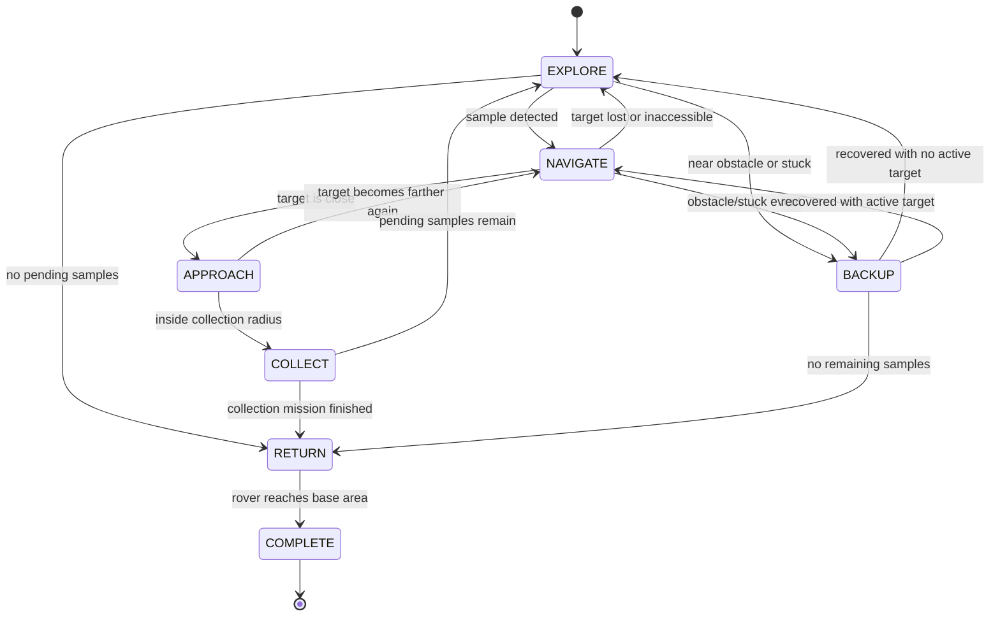

# ExploRover - Technical Report for Judges (Challenge 2: Autonomous Explorer Robot)

This repository presents an autonomous rover developed in Webots for unknown-environment exploration and sample collection, aligned with the robotics track requirements.

## 1. Executive Summary

The system implements an end-to-end autonomous control loop for an exploration rover with:

- Obstacle-aware navigation in a randomized map.
- Visual sample detection and approach.
- Sample collection with a front shovel actuator.
- Recovery behavior for blocking/stuck situations.
- Optional mission completion behavior: return to base.

Main technical capabilities:

- Differential-drive autonomous motion.
- Real-time obstacle avoidance.
- Occupancy-grid mapping from LiDAR.
- Path planning with A* and adaptive inflation.
- Target tracking and mission-state transitions.
- GUI-based environment configuration (without editing controller logic).

## 2. System Objective and Scope

Mandatory goals:

- Navigate without collisions.
- Detect points of interest (samples).
- Move toward detected samples.
- Collect at least one sample.

Optional goals:

- Collect multiple samples.
- Return autonomously to a defined base area.

## 3. Sensors and Actuators

### Sensors

| Component | Type | Role in Control System |
|---|---|---|
| lidar | 360 distance sensor | Obstacle detection, occupancy-grid updates, frontal risk estimate |
| camera + recognition | Vision sensor | Sample detection and identification |
| gps | Position sensor | Global x, y pose |
| compass | Orientation sensor | Heading theta for navigation/control |

Note: map_display is used for runtime visualization (HUD/map) and debugging support, not as a perception input.

### Actuators

| Component | Type | Role |
|---|---|---|
| left_motor | Drive actuator | Left wheel velocity control |
| right_motor | Drive actuator | Right wheel velocity control |
| shovel_motor | Collection actuator | Shovel down/up motion for collection |

## 4. Perceive-Decide-Act Control Loop

```text
FUNCTION main_loop():
  WHILE mission_active:
    # 1) PERCEIVE
    pose <- read(gps, compass)
    ranges <- read(lidar)
    target <- detect_samples(camera_recognition)
    update_occupancy_grid(ranges, pose)

    # 2) DECIDE
    state <- determine_state(pose, target, ranges)
    action <- select_action(state)

    # 3) ACT
    execute(action)

    wait(DELTA_T)
```

## 5. State Machine

Implemented states:

- EXPLORE
- NAVIGATE
- APPROACH
- COLLECT
- BACKUP
- RETURN
- COMPLETE



## 6. Configurable Simulation Interface

The project includes a Tkinter GUI in [configurador.py](configurador.py) to configure runs quickly.

Supported GUI actions:

- Select [worlds/rover_explorer.wbt](worlds/rover_explorer.wbt).
- Choose difficulty presets (Easy/Normal/Hard/Extreme).
- Set number of obstacles (0 to 15).
- Set number of samples (1 to 10).
- Write settings directly to world controller arguments.

Configuration line written in the world file:

```text
controllerArgs ["n_obstacles", "n_samples"]
```

## 7. Challenge Test Compliance Matrix

| Test Case | Priority | Implementation Evidence | Status |
|---|---|---|---|
| TC-01 Collision-free navigation | Mandatory | Reactive avoidance + A* planning + BACKUP state | Achieved in typical simulation runs |
| TC-02 Sample detection and collection | Mandatory | Camera recognition + NAVIGATE/APPROACH/COLLECT transitions | Achieved |
| TC-03 Obstacle evasion while moving to target | Mandatory | Replanning + adaptive inflation + BACKUP recovery | Achieved |
| TC-04 Multiple sample collection | Optional | Multi-target handling and repeated collection cycle | Implemented |
| TC-05 Return to base | Optional | RETURN state with trail-based return and re-navigation | Implemented |

Metric note:

- The controller prints validation information, but collision counting is not fully instrumented in the current implementation (`self.col` is not incremented). For judge reporting, visual evidence is included and should be used together with observed behavior.

## 8. Simulation Environment Specification

| Parameter | Current Value |
|---|---|
| Map size | 4.0 m x 4.0 m |
| Grid resolution | 0.05 m/cell |
| Approximate base position | (-1.75, -1.75) |
| Approximate rover initial pose | (-1.65, -1.65, 0.055) |
| Obstacle range | 0 to 15 (configurable) |
| Sample range | 1 to 10 (configurable) |
| Collection radius | 0.25 m |
| Front backup trigger distance | 0.22 m |
| Max no-progress timeout per target | 120 s |

## 9. Deliverables Checklist

| Deliverable | Status in Repository |
|---|---|
| Control-loop pseudocode or state diagram | Included (Sections 4 and 5) |
| System architecture details | Included (sensors, actuators, states, navigation) |
| Demo/simulation video | Included (2 videos in Videos folder) |
| Source code | Included |
| Environment description | Included |

## 10. Visual Evidence for Judges (GitHub)

Available videos in this repository:

- [Videos/rover_explorer.mp4](Videos/rover_explorer.mp4)
- [Videos/rover_explorer_1.mp4](Videos/rover_explorer_1.mp4)

Evidence matrix:

| Test Case | Expected Evidence | Video Link |
|---|---|---|
| TC-01 | 60-second collision-free exploration behavior | [Videos/rover_explorer.mp4](Videos/rover_explorer.mp4) |
| TC-02 | Detection and collection of at least one sample | [Videos/rover_explorer.mp4](Videos/rover_explorer.mp4) |
| TC-03 | Alternative-route evasion with obstacle in target path | [Videos/rover_explorer_1.mp4](Videos/rover_explorer_1.mp4) |
| TC-04 (optional) | Collection of 2+ samples within mission time | [Videos/rover_explorer_1.mp4](Videos/rover_explorer_1.mp4) |
| TC-05 (optional) | Autonomous return to base without new collisions | [Videos/rover_explorer_1.mp4](Videos/rover_explorer_1.mp4) |

Sensor-level visual evidence expected by judges:

- LiDAR usage is visible through the occupancy-grid/map update during runtime (obstacle perception and free-space estimation).
- Camera-based recognition is visible through the target framing/bounding box overlay when a sample is detected.
- The demo should show at least one full sequence: detect target with camera frame, navigate while avoiding obstacles with LiDAR-based mapping, then collect.

Recommended judge-facing capture style:

- Include top-down (bird-eye) map visibility.
- Keep the runtime HUD visible when possible.
- Mark timestamps per test case in demo notes.

## 11. Repository Structure

```text
ExploRover/
|-- configurador.py
|-- README.md
|-- controllers/
|   `-- RoverExplorer/
|       `-- RoverExplorer.py
|-- Videos/
|   |-- rover_explorer.mp4
|   `-- rover_explorer_1.mp4
`-- worlds/
    `-- rover_explorer.wbt
```

## 12. Reproducibility and Run Instructions

Requirements:

- Webots R2025a
- Python 3

Steps:

1. Run the configurator:

```bash
python configurador.py
```

2. Select obstacle/sample counts and save world settings.
3. Open [worlds/rover_explorer.wbt](worlds/rover_explorer.wbt) in Webots.
4. Start the simulation.
5. Record/validate at least TC-01, TC-02, and TC-03.
